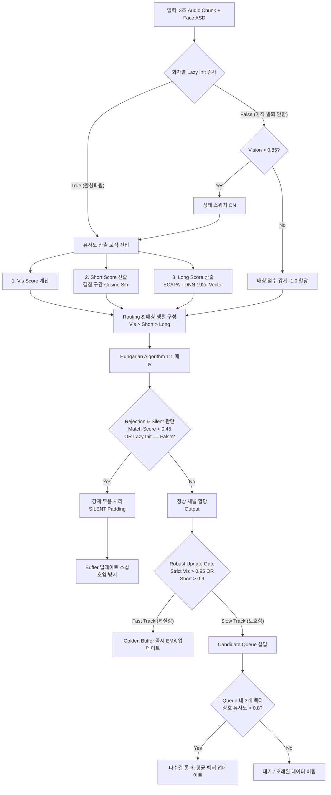

## Advanced Hybrid CSS 알고리즘 구조

아래는 새롭게 개선된 알고리즘의 동작 흐름도입니다.

```mermaid
graph TD
    A[입력: 3초 Audio Chunk + Face ASD] --> B{화자별 Lazy Init 검사}
    B -- "False (아직 발화 안함)" --> C{Vision > 0.85?}
    C -- Yes --> D[상태 스위치 ON]
    C -- No --> E[매칭 점수 강제 -1.0 할당]
    B -- "True (활성화됨)" --> F[유사도 산출 로직 진입]
    D --> F
    
    F --> G[1. Vis Score 계산]
    F --> H[2. Short Score 산출 <br/> 겹침 구간 Cosine Sim]
    F --> I[3. Long Score 산출 <br/> ECAPA-TDNN 192d Vector]
    
    G & H & I --> J[Routing & 매칭 행렬 구성 <br/> Vis > Short > Long]
    E --> J
    
    J --> K[Hungarian Algorithm 1:1 매칭]
    
    K --> L{Rejection & Silent 판단 <br/> Match Score < 0.45 <br/> OR Lazy Init == False?}
    
    L -- Yes --> M[강제 무음 처리 <br/> SILENT Padding]
    L -- No --> N[정상 채널 할당 <br/> Output]
    
    M --> O[Buffer 업데이트 스킵 <br/> 오염 방지]
    N --> P{Robust Update Gate <br/> Strict Vis > 0.95 OR <br/> Short > 0.9}
    
    P -- "Fast Track (확실함)" --> Q[Golden Buffer 즉시 EMA 업데이트]
    P -- "Slow Track (모호함)" --> R[Candidate Queue 삽입]
    
    R --> S{Queue 내 3개 벡터 <br/> 상호 유사도 > 0.8?}
    S -- Yes --> T[다수결 통과: 평균 벡터 업데이트]
    S -- No --> U[대기 / 오래된 데이터 버림]
```
